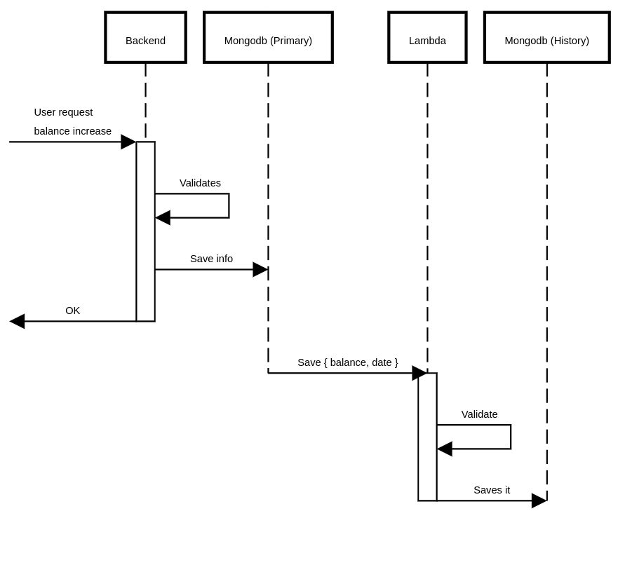

> I recently have the need for research how to track changes in a database due to compliance with users and stakeholders, this is a really interesting system-design topic since requires a bit of understanding (in this specific case) of mongo advanced topics and a bit of streams processing.

<!-- truncate -->

## Why to track changes?
Well simply as know how a value change over time can have a very high impact on many areas like finance if we realize that our wallet has changed from 300dlls to 0... it would be in our interest to know why and when happened. Therefore we need a reliable way to do it without too much pain. 

## How to do it?
Basically the first thing to do is determine business requirements, for our case we will limit to know only when and the value that changed, but the same logic can be extended to cover even more. 

The first thing to realize is WHEN this needs to happened, mongodb since (mongo 4.0) implemented change-streams this are a way to subscribe into real-time data changes over time (this sound sufficient, but we realize that we're missing something) 

My proposal requires:
> A different collection (ideally a different DB) for saving the history changes. Having a different DB will provide the flexibility as same names for collections with different purposes.

The historyDB don't require the same size as the primary instance this also depends on business requirements.

My recommendation for this approach is using a Queue for handling all the changes across the database. Therefore we can track or a simple lambda if we're not tracking a lot of changes.
Notice how the post-processing of the lambda is handled even after the request is made (also another thing is that event changes may happen a moment AFTER and history-changes are not happen inmediatly after but this is rarely a requirement)

## How would the data look like ?
Basically we can store as a different documents, each one of them representing a different change, like the following:

Finally, a full view of this explanation is explained in the following diagram having the PrimaryDB (Mongo) + Queue + Lambda + HistoryDB (Mongo)

Considerations:
- This is event-driven, therefore NOT requires a CRON to be updating information
- The same Lambda can process a batch of pending changes, therefore making the computation more efficient
- If you're using Atlas MongoDB you could read also about [triggers](https://www.mongodb.com/docs/atlas/app-services/triggers/database-triggers/) and what they can do for you!

This avoids using plugins for mongoose if you're using Mongoose + NodeJs, and uses a more clean approach leveraging stream processing with SQS + Lambda.